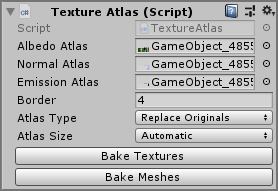

# Unity Texture Atlas Generator

[Download Package](https://github.com/danielklisch/unity_texture_atlas/raw/main/dynamic_texture_atlas.unitypackage)

The Unity game engine creates a draw call for each material attached to a mesh renderer. This means that using many materials with different textures can significantly impact performance. Grouping the textures into a texture atlas makes it possible to use only a single material and thus only one draw call. An atlas generator automatically groups textures into an atlas and modifies the meshes so they can be used with the atlas material. Compared to traditional atlas generators this generator has the option to modify the mesh when it is loaded at runtime, meaning the user does not need to bake the mesh every time modifications are made. It can also deal with arbitrary uv maps since the information about the atlas is stored in the uv2 and uv3 channels. This makes it possible to tile the same texture multiple times across a single face, as well as change the tiling factor after the atlas has already been built.

## Usage

Assign the "TextureAtlas" Component to an Object. Make sure all the meshes and textures you want to bake are readable in the import settings. Then Click "Bake Textures". The "Border" value can be used to stop adjacent textures from bleeding into eachother.

Example of a generated texture atlas

## Dynamic Meshes
This option modifies meshes at runtime to work with the generated atlas. This means that the base model can be edited without having to worry about the texture atlas. It also makes it possible to make the usage of texture atlases a setting the user can change at runtime, in case there are effects that don't work well with texture atlases. However, this option can increase loading times, especially for large meshes.

## Baked Meshes
The meshes are prepared when clicking the "Bake Meshes" button, but only replace the original meshes at runtime. This option does not have the same drawback as the dynamic option, and it still keeps the original data attached to the object so it can be modified. However, it requires clicking the "Bake Meshes" button every time the model is modified.

## Replace Originals
The original objects are replaced with the atlas versions. This delivers the best performance but makes it difficult to make changes to the original model. However the changes can easily be undone by clicking the "Revert" button.

## Known Limitations
The atlas texture does not support mipmaps as a result of needing to handle arbitrary input uvs. The atlas shader is also limited in terms of texture maps it can accept, but it can be easily extended.
